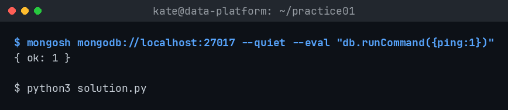
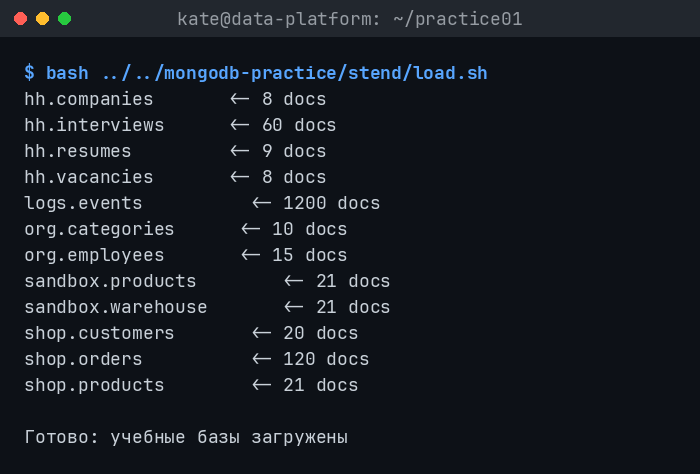
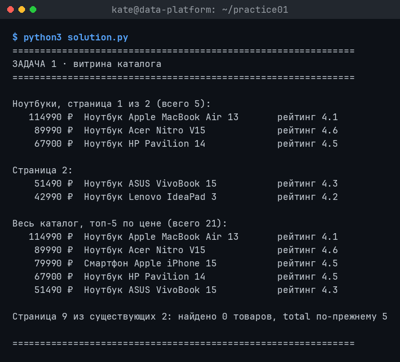
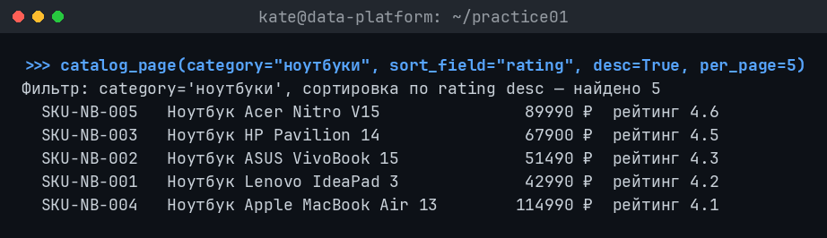
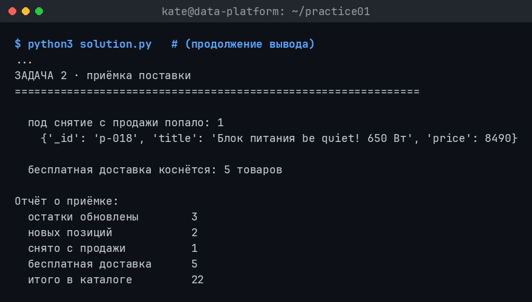
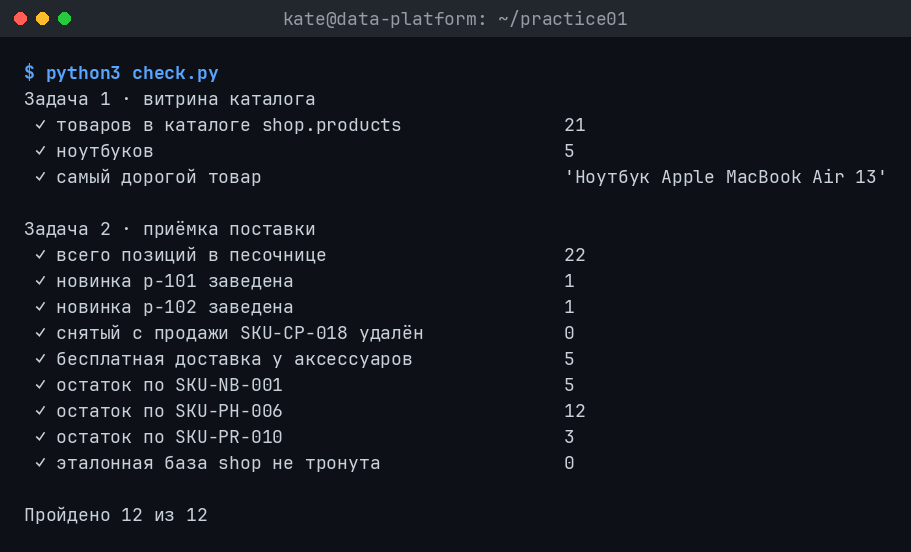

# Домашнее задание № 3 · «Каталог товаров»

Срок — до начала следующего занятия.

## Задание

Выполните практическую работу из справочника:

<https://maximbytecamp.github.io/mongodb_theory_makarov/praktiki/01-katalog-tovarov/index.html>

Работайте в своей копии `data-platform-template`. Если практика предлагает
несколько вариантов запуска, укажите в отчёте выбранный вариант. Все команды и
запросы должны быть выполнены на вашей базе MongoDB.

Выбранный вариант реализации: **Python** (`pymongo`), решение — [`../practice01/solution.py`](../practice01/solution.py).

## Что должно быть сделано

1. Запустить MongoDB и программу каталога.
2. Создать или загрузить товары, предусмотренные практикой.
3. Выполнить все операции практической работы: чтение каталога, поиск/фильтрацию
   и остальные операции, указанные в инструкции.
4. Проверить результат непосредственно в MongoDB Compass или в терминале.
5. Заполнить этот файл и приложить скриншоты.

## Заполните отчёт

**ФИО:** ...
**Группа:** ...
**Дата:** 23.09.2026

### Среда выполнения

- ОС: Linux (Omarchy)
- Язык и версия: Python 3.14.7, pymongo 4.18.1
- MongoDB / Compass: MongoDB Server 8.3.9 (проверка через `mongosh`)
- База данных: `shop` (чтение) и `sandbox` (запись)
- Коллекция: `products`
- Команда запуска: `python3 practice01/solution.py`

### Результаты

Данные загружены сидовым набором курса (`stend/load.sh`): в `shop.products` —
21 товар, в том числе 5 ноутбуков. Из них программа строит витрину каталога:
функция `catalog_page()` отдаёт постраничный список с проекцией только нужных
полей (`sku`, `title`, `price`, `rating`), сортировкой по цене и `sku` как
вторым ключом, и отдельно посчитанным `total`. Запрос страницы за пределами
данных (страница 9 при 2 существующих) вернул пустой список и корректный
`total = 5` — ошибки нет.

Отдельный запрос-фильтр `catalog_page(category="ноутбуки", sort_field="rating", desc=True)`
вернул все 5 ноутбуков, отсортированных по рейтингу от 4.6 до 4.1.

Дальше выполнена приёмка поставки в `sandbox.products`:

- остатки трёх артикулов (`SKU-NB-001`, `SKU-PH-006`, `SKU-PR-010`) увеличены
  атомарным `$inc` на 5, 12 и 3 единицы соответственно;
- добавлены две новые позиции — `p-101` (подставка для ноутбука) и `p-102`
  (чехол для планшета) — через `insert_many(ordered=False)`;
- снят с продажи товар `SKU-CP-018`: сначала выведено предпросмотром 1
  найденное совпадение, затем документ удалён;
- всем 5 товарам категории «аксессуары» проставлен флаг `free_shipping = true`
  через `update_many`.

Итог: в `sandbox.products` стало 22 позиции, база `shop` (эталон) не
изменилась — проверка `check.py` подтвердила все 12 из 12 условий.

### Скриншоты

1. Запуск: 
2. Создание товаров: 
3. Каталог: 
4. Поиск: 
5. Изменение/удаление: 
6. Проверка в базе: 

### Ответы на вопросы

1. **Какие поля есть у документа товара? Какие поля должны иметь числовой тип
   и почему цену и количество нельзя хранить строками?** Документ товара
   содержит `_id`/`sku` (идентификатор), `title` (строка), `category`
   (строка), `price` (число), `rating` (число), а в песочнице ещё `qty_total`
   (число) и `free_shipping` (булево). Числовыми обязаны быть `price`,
   `rating` и `qty_total`: их сравнивают (`$gt`, сортировка по цене) и
   изменяют атомарно (`$inc` по остаткам). Если хранить цену или количество
   строкой, сортировка станет лексикографической («100» окажется раньше «20»),
   операторы сравнения и `$inc` перестанут работать или дадут ошибку — базе
   всё равно, что в кавычках, но арифметика со строками не определена.

2. **Чем обычное чтение коллекции отличается от поиска по условию? Приведите
   пример запроса или фрагмента кода из своей работы.** Обычное чтение —
   `find({})` без фильтра — возвращает все документы в порядке, который
   выберет сервер. Поиск по условию передаёт в `find()` документ-фильтр,
   и сервер отбирает только совпадающие записи ещё до отправки клиенту. В
   решении это `catalog_page(category="ноутбуки", ...)`, который внутри
   собирает `query = {"category": category}` и вызывает
   `products.find(query, CARD).sort(...).skip(...).limit(...)` — фильтрация,
   проекция и сортировка выполняются на сервере, а не в Python после
   получения всех документов.

3. **Как вы проверили, что операция действительно изменила данные в MongoDB,
   а не только текст в интерфейсе программы?** Проверка сделана независимо от
   самой программы: во-первых, отдельным скриптом `check.py`, который заново
   подключается к MongoDB и через `count_documents`/`find_one` читает
   реальное состояние `sandbox.products` — 12 из 12 условий совпали. Во-вторых,
   напрямую через `mongosh` (терминал), запросом
   `db.products.findOne({sku:"SKU-NB-001"}).qty_total`, который вернул 5 —
   ровно то приращение, что должна была сделать операция `$inc`. Оба способа
   читают из базы заново, в обход вывода программы, поэтому подтверждают
   изменение данных, а не просто текст в консоли.

### Вывод

Я научился(ась) строить постраничную витрину каталога с фильтром, проекцией и
двойной сортировкой, а также безопасно менять данные в MongoDB через
атомарные операции (`$inc`, `update_many`, `insert_many` с обработкой
дублей, `delete_many` по схеме «посчитать → показать → удалить»). Программа
запускается повторно без ошибок подключения и не дублирует данные при
повторном запуске (кроме `$inc`, для которого нужны чистые данные). В MongoDB
проверено: `shop.products` — 21 товар без изменений (эталон не тронут),
`sandbox.products` — 22 товара после приёмки поставки, все числа подтверждены
и через `check.py`, и напрямую через `mongosh`.
