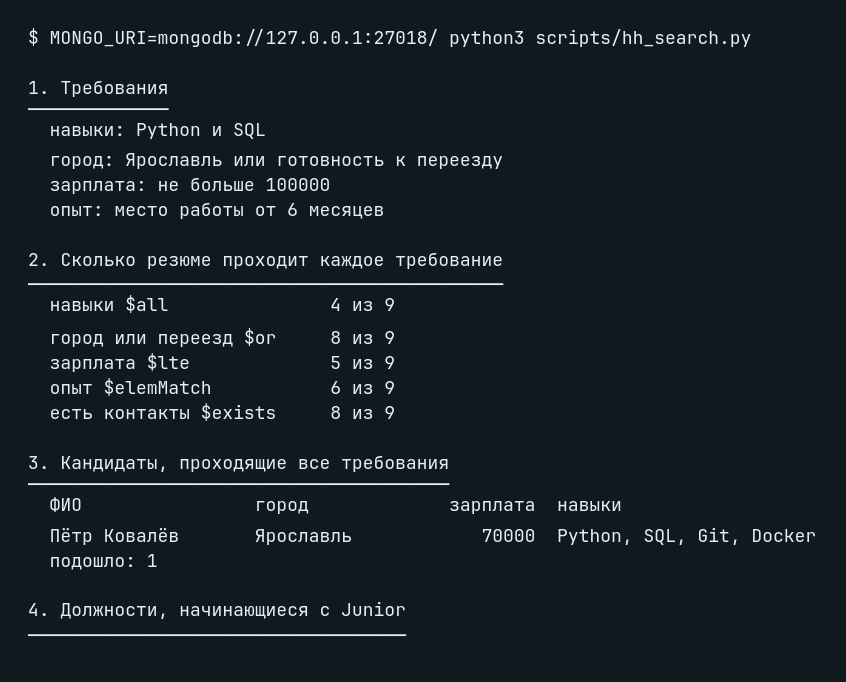
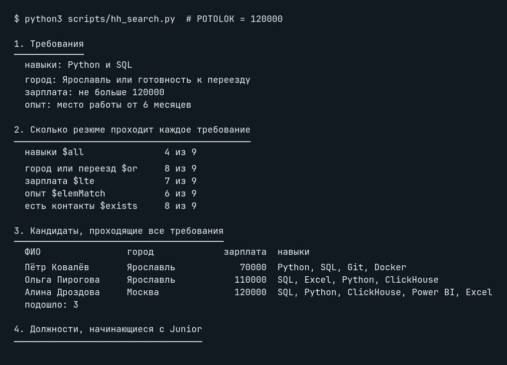
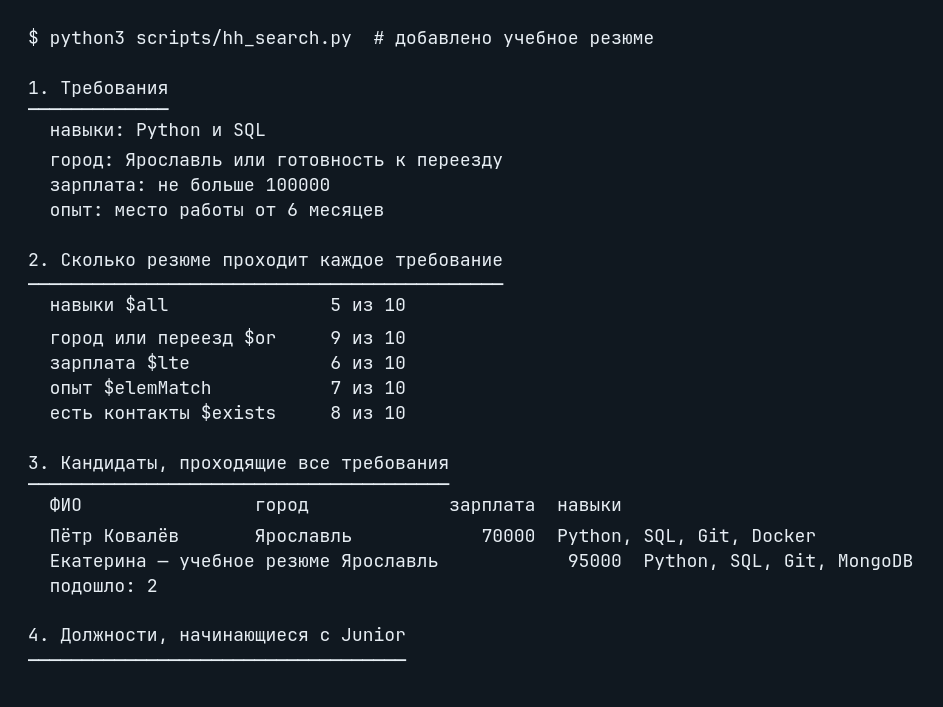

# Домашнее задание № 5 · Скрипт подбора кандидатов

Язык выполнения — Python. Скрипт `scripts/hh_search.py` запущен на учебной
коллекции `hh.resumes` (9 исходных документов).

## Операторы в разделах отчёта

| Раздел | Оператор или приём | Как используется |
|---|---|---|
| 1. Требования | — | Значения четырёх переменных задают фильтр; запроса к MongoDB здесь нет. |
| 2. Каждое требование | `$all`, `$or`, `$lte`, `$elemMatch`, `$exists` | Считаются резюме, прошедшие каждое условие по отдельности. |
| 3. Все требования | `$all`, `$lte`, `$elemMatch`, `$or` | Все условия объединены в один фильтр кандидата. |
| 4. Junior-должности | `$regex` с `$options: "i"` | Ищется начало строки `junior` без учёта регистра. |
| 5. Вакансии | точечная нотация, `$lte`, `$gte` | Ожидание попадает между `salary.from` и `salary.to`. |
| 6. Собеседования | `$gte`, `$lt` | Дата попадает в полуинтервал недели. |
| 7. Проверка данных | `$exists`, `$not`, `$type`, `$size`, `$expr`, `$gt`, `$ne` | Проверяются пропуски, типы, пустые массивы, вилки и статус вакансии. |
| 8. Причины отказа | обычные проверки Python | Причины формируются после выборки в коде (`set`, сравнение, `any`), без отдельного MongoDB-оператора. |

## Прогоны

Во всех строках менялся только один параметр, затем файл возвращался к
исходным значениям.

| Что изменено | Подошло кандидатов | Кто |
|---|---:|---|
| ничего, исходные требования | 1 | Пётр Ковалёв |
| навыки: `Python` | 2 | Пётр Ковалёв, Марк Ефремов |
| город: `Москва` | 0 | — |
| потолок зарплаты: `120000` | 3 | Пётр Ковалёв, Ольга Пирогова, Алина Дроздова |
| срок работы: `4` месяца | 2 | Пётр Ковалёв, Ксения Лапина |
| добавлено учебное резюме Екатерины | 2 | Пётр Ковалёв, Екатерина — учебное резюме |

Для последней строки в изолированную учебную базу добавлено резюме с навыками
`Python` и `SQL`, городом Ярославль, зарплатой 95 000 и опытом 8 месяцев.
Оно найдено разделом 3. После проверки временная база будет удалена.

## Скриншоты запусков

## Вывод

Нужно смягчить только потолок зарплаты: с **100 000** до **120 000**. Тогда
в разделе 3 находятся три кандидата: Пётр Ковалёв, Ольга Пирогова и Алина
Дроздова. Это обосновано разделом 2: ограничение зарплаты при исходном потолке
проходят 5 из 9 резюме, а при 120 000 — 7 из 9; остальные исходные условия не
менялись. Раздел 8 подтверждает причину: Алина и Ольга не проходили только из-за
зарплаты выше 100 000. Прогон с новым потолком дал `подошло: 3`.
